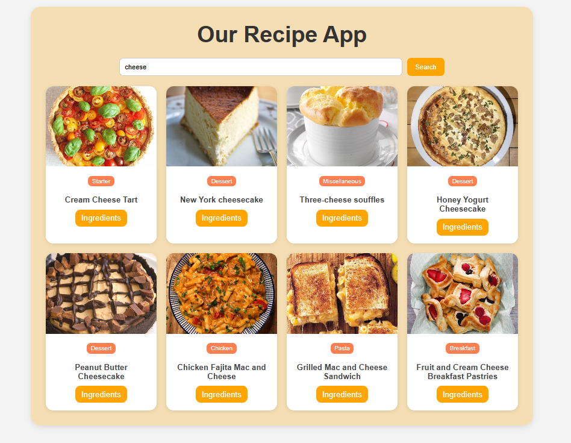

# Food Plaza App

A modern and responsive **Food Recipe Web Application** built using **React.js** and **React Router**.

🔗 **Live Demo**: [Food Plaza App](https://food-plaza-app.netlify.app/)

---

##  Features

*  Search recipes by keywords
*  Filter recipes with categories (Vegetarian, Breakfast, Seafood, etc.)
*  Fully responsive design
*  Built with React.js & deployed on Netlify

---

##  Tech Stack

* **React.js**
* **React Router**
* **CSS (Custom Styling)**
* **Netlify (Deployment)**

---

## Installation

Clone the repo and install dependencies:

```bash
git clone https://github.com/Kumari-Mansi/Food_Recipe_App.git
cd Food_Recipe_App
npm install
```

Run locally:

```bash
npm start
```

Build for production:

```bash
npm run build
```

---

## 🌐 Deployment

This project is deployed on **Netlify**.
👉 Live App: [https://food-plaza-app.netlify.app/](https://food-plaza-app.netlify.app/)

---

## 📸 Screenshots
./Screenshot-1.png
./Screenshot-2.png
./Screenshot-3.png

### 🔍 Recipe Search



---
